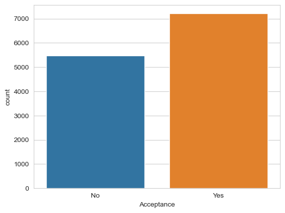
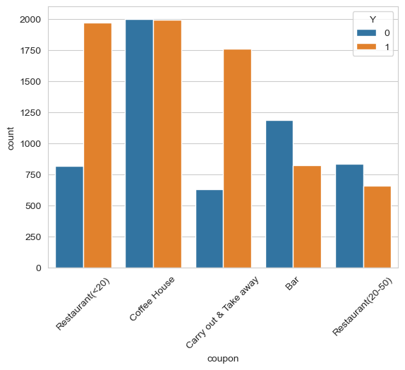
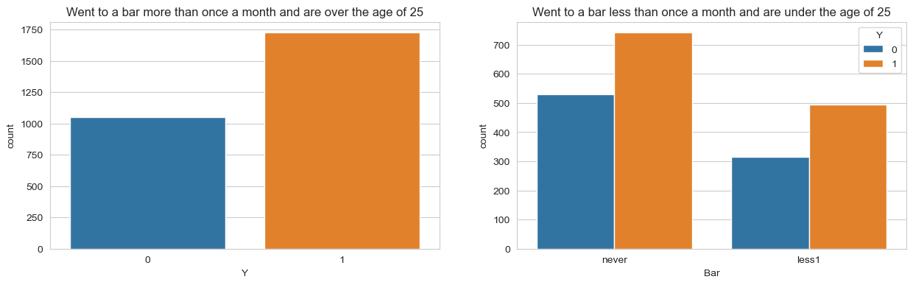
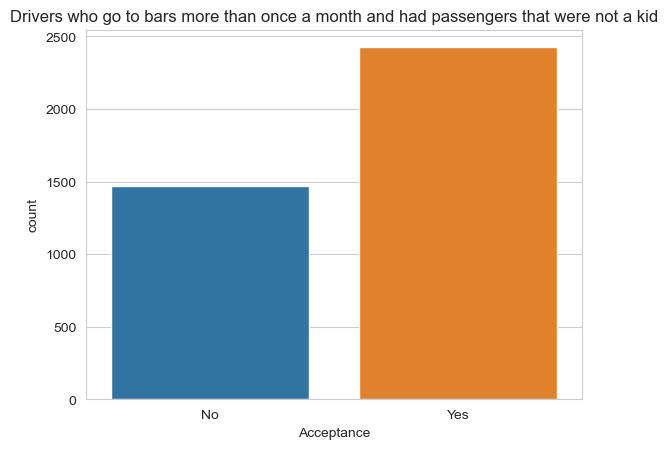
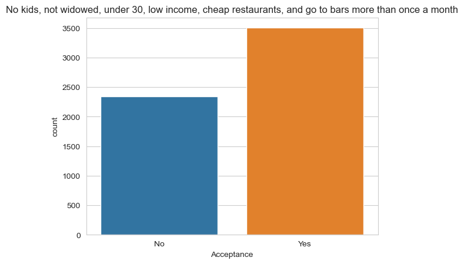

# Will the customer accept the coupon?

## Overview

Imagine driving through town and a coupon is delivered to your cell phone for a restaraunt near where you are driving. Would you accept that coupon and take a short detour to the restaraunt? Would you accept the coupon but use it on a sunbsequent trip? Would you ignore the coupon entirely? What if the coupon was for a bar instead of a restaraunt? What about a coffee house? Would you accept a bar coupon with a minor passenger in the car? What about if it was just you and your partner in the car? Would weather impact the rate of acceptance? What about the time of day?

Obviously, proximity to the business is a factor on whether the coupon is delivered to the driver or not, but what are the factors that determine whether a driver accepts the coupon once it is delivered to them? How would you determine whether a driver is likely to accept a coupon?

## The Data

This data comes to us from the UCI Machine Learning repository and was collected via a survey on Amazon Mechanical Turk. The survey describes different driving scenarios including the destination, current time, weather, passenger, etc., and then ask the person whether he will accept the coupon if he is the driver. Answers that the user will drive there ‘right away’ or ‘later before the coupon expires’ are labeled as ‘Y = 1’ and answers ‘no, I do not want the coupon’ are labeled as ‘Y = 0’.  There are five different types of coupons -- less expensive restaurants (under \\$20), coffee houses, carry out & take away, bar, and more expensive restaurants (\\$20 - \\$50).

## Data processing

* I found very few missing values in the data set.
* Dropped the `cars' column because it does not contain any useful information.
* Missing values in the following columns were backfilled to "never":
  * Bar
  * CoffeeHouse
  * CarryAway
  * RestaurantLessThan20
  * Restaurant20To50

## Analysis
The acceptance rate of coupons across all samples is 56.84%. Then we dig deeper into the type of coupons.

We will focus first on the 'Bar' coupon, looking deeper into the demographics of the survey respondents.

We can see that there a a lor more samples of drivers over the age of 25 that attend a bar at least once a month, and not so many under 25 who don't drink.
Then we look are some of these drivers that drink but are not traveling with kids

And then we can look at the drivers that do not have kids, go to bars at least once a month, and spend more time at cheap restaurants

## Conclusion
* People over the age of 25 who go to bars more than once a month and have passengers that are not kids are more likely to accept the bar coupons.
* People below 30 years of age who go to bars more than once a month are more likely to accept the bar coupons, but not by much.
* The company should focus in drivers over 25, not traveling with kids, and go to bars more than once a month.

 
